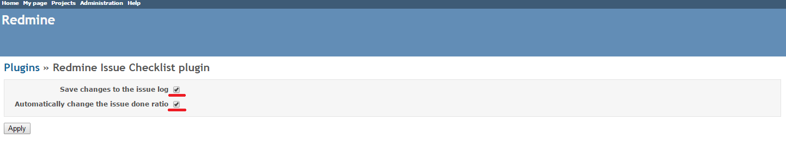
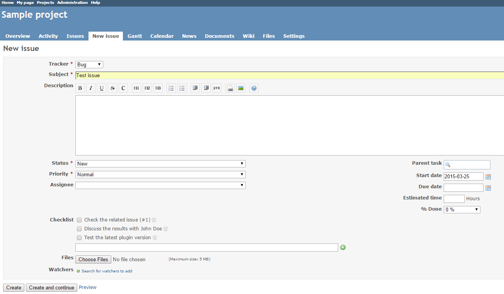
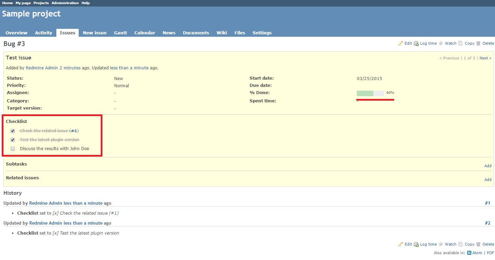
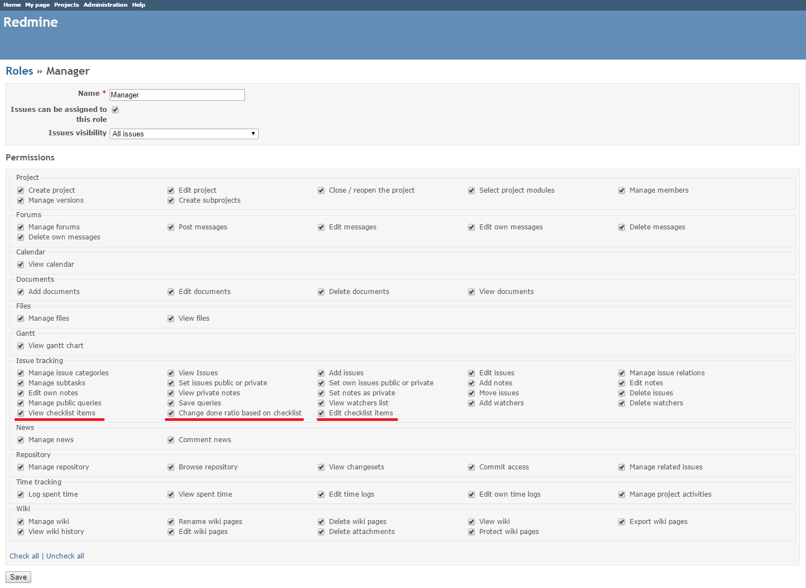

# Redmine Issue Checklist Plugin

This plugin enables you to add checklists to Redmine issues. 

The initial author of the plugin is [Kirill Bezrukov](http://www.redminecrm.com/projects/checklist/pages/1)

## Compatibility

This plugin version is compatible only with Redmine 2.0 and later.

## Installation

1. To install the plugin
    * Download the .ZIP archive, extract files and copy the plugin directory into #{REDMINE_ROOT}/plugins.
    
    Or

    * Change you current directory to your Redmine root directory:  

            cd {REDMINE_ROOT}
            
      Copy the plugin from GitHub using the following commands:
      
            git clone https://github.com/Undev/redmine_issue_checklist.git plugins/redmine_issue_checklist
            
3. This plugin requires a migration. Run the following command to upgrade your database (make a database backup before):  

        bundle exec rake redmine:plugins:migrate RAILS_ENV=production 
        
3. Restart Redmine.

Now you should be able to see the plugin in **Administration > Plugins**.

## Usage

The Redmine Issue Checklist plugin enables you to add checklists to Redmine issues.

You can configure the plugin to track the checklist changes in the issue log and change the issue done ratio based on the checklist progress. To do this, go to **Administration > Plugins**, clik**Configure** and select the corresponding check boxes.  

To add a checklist to an issue, enter the checklist item text into the the **Checklist** field in the issue description and click the **+** button.  

You can add as many checklist items as you need. To rearrange the checklist, drag and drop the items in the desired order. To delete an item, click the trash bin icon.  

To mark the completed checklist items, select the corresponding check boxes. The plugin will display the changes in the issue log and change the issue done ratio, if you have configured it accordingly.  

To manage checklist-related permissions, go to **Administration > Roles and permissions**, click the role name and select or clear the required check boxes.  

## Testing

Run test using the following command:

    rake redmine:plugins:test NAME=redmine_issue_checklist RAILS_ENV=test_sqlite3
 
## License

Copyright (c) 2015 Undev

Licensed under the Apache License, Version 2.0 (the "License");
you may not use this file except in compliance with the License.
You may obtain a copy of the License at

http://www.apache.org/licenses/LICENSE-2.0

Unless required by applicable law or agreed to in writing, software
distributed under the License is distributed on an "AS IS" BASIS,
WITHOUT WARRANTIES OR CONDITIONS OF ANY KIND, either express or implied.
See the License for the specific language governing permissions and
limitations under the License.
